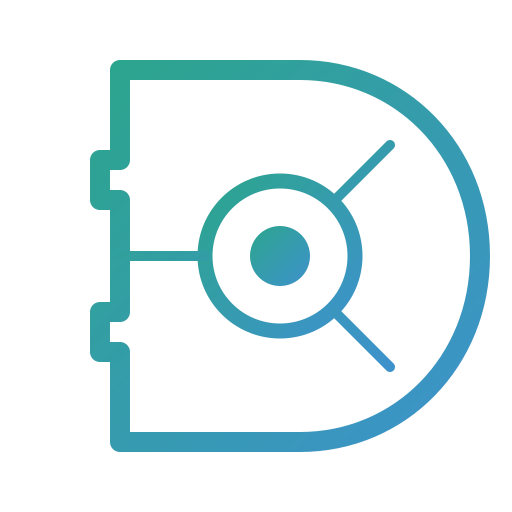

# Devvault Solutions 💎

A premium, cinematic digital presence for **Devvault Solutions**—a high-end software development house specializing in custom solutions, blockchain, and AI.



## 🚀 Vision
Devvault Solutions is built to provide elite software services with a focus on cutting-edge aesthetics, performance, and client satisfaction. Our platform is a reflection of our commitment to quality—featuring cinematic animations, premium glassmorphism, and highly interactive user experiences.

## 🔗 Connect With Us
We've moved our primary community and support hub to Discord!

*   **Discord Server**: [Join Devvault Solutions](https://discord.gg/7NrwwBhfkN)
*   **Website**: [devvaultsolutions.com](https://devvaultsolutions.com)

## ✨ Core Features
- **Cinematic Design**: High-end animations using `framer-motion` and `AOS`.
- **Glassmorphism 2.0**: Premium UI elements with advanced blur and glow effects.
- **Responsive Layout**: Edge-to-edge cinematic experiences on all screen sizes.
- **Interactive Map**: Custom-designed 1400px wide cinematic map on the contact page.
- **Live Logo Loader**: Custom SVG-traced loading experience.

## 🛠️ Tech Stack
- **Frontend**: React.js, Vite
- **Styling**: Styled-Components (Vanilla CSS approach)
- **Animations**: Framer Motion, AOS (Animate On Scroll)
- **Icons**: React Icons
- **Typography**: Poppins (Google Fonts)

## 📦 Getting Started

### Prerequisites
- [Node.js](https://nodejs.org/) (v18 or higher recommended)
- [Git](https://git-scm.com/)

### Installation
1.  **Clone the Repository**:
    ```bash
    git clone https://github.com/Junaid-Ikram/Dev-vault.git
    cd Dev-vault
    ```
2.  **Install Dependencies**:
    ```bash
    npm install
    ```
3.  **Run Development Mode**:
    ```bash
    npm run dev
    ```

## 🏗️ Deployment
For detailed instructions on deploying this project to a **Windows VPS**, please refer to the [DEPLOYMENT.md](./DEPLOYMENT.md) guide.

---
© 2026 Devvault Solutions. All rights reserved.
